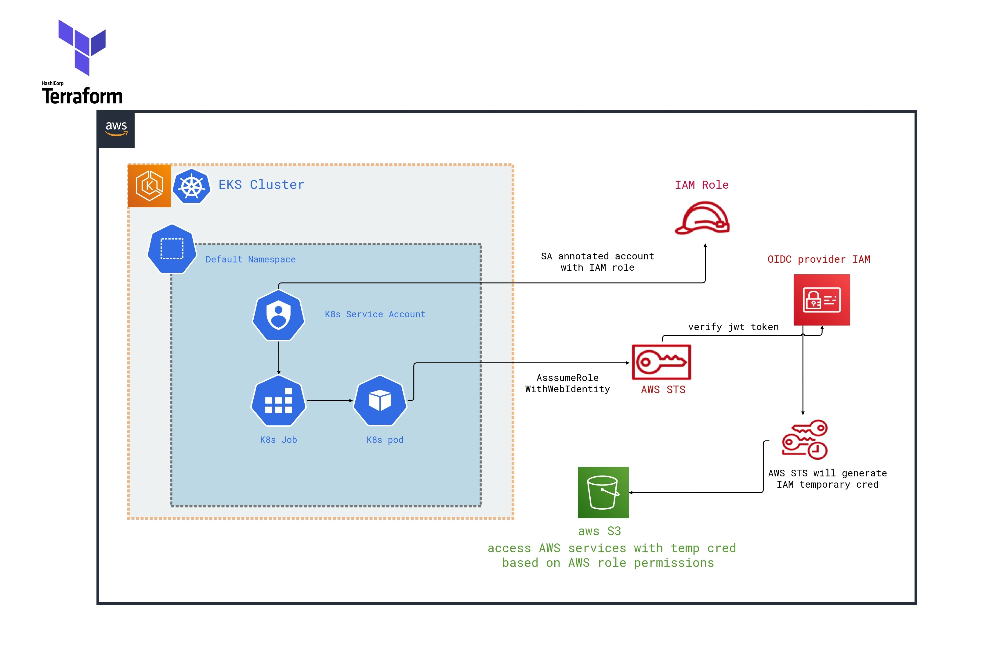

# IAM Roles for Service Accounts in EKS Using Terraform
This project demonstrates how to configure EKS, OpenID Connect (OIDC) provider, IAM Roles, and service accounts using Terraform. With the latest releases of EKS, AWS Kubernetes control plane comes with support for IAM roles for service accounts. This feature allows you to associate an IAM role with a Kubernetes service account, which can provision temporary credentials and provide AWS permissions to the containers in any pod that uses that service account.

This project uses EKS 1.14, Terraform 0.12.12, and Terraform AWS provider 2.28.1.

# Advantages
The IAM roles for service accounts feature provides the following benefits:

<ul>
<li> <h3>Least privilege:</h3> You no longer need to provide extended permissions to the worker node IAM role so that pods on that node can call AWS APIs. You can scope IAM permissions to a service account, and only pods that use that service account have access to those permissions.
<li> <h3>Credential isolation:</h3>  A container can only retrieve credentials for the IAM role that is associated with the service account to which it belongs. A container never has access to credentials that are intended for another container that belongs to another pod.
<li> <h3>Auditability:</h3>  Access and event logging are available through CloudTrail to help ensure retrospective auditing.
</ul>

## Technical Overview
AWS IAM supports federated identities using OIDC. This feature allows you to authenticate AWS API calls with supported identity providers and receive a valid OIDC JSON web token (JWT). You can pass this token to the AWS STS AssumeRoleWithWebIdentity API operation and receive IAM temporary role credentials. Such credentials can be used to communicate with services like Amazon S3 and DynamoDB.

Kubernetes has long used service accounts as its internal identity system. Pods can authenticate with the Kubernetes API server using an auto-mounted token (which was a non-OIDC JWT) that only the Kubernetes API server could validate. These legacy service account tokens do not expire, and rotating the signing key is a difficult process. In Kubernetes version 1.12, support was added for a new ProjectedServiceAccountToken feature, which is an OIDC JSON web token that also contains the service account identity, and supports a configurable audience.

Amazon EKS now hosts a public OIDC discovery endpoint per cluster containing the signing keys for the ProjectedServiceAccountTokenJSON web tokens so external systems, like IAM, can validate and accept the OIDC tokens issued by Kubernetes.

## Implementation and Configuration
The project creates an EKS cluster and an OIDC provider using Terraform. The aws_eks_cluster resource configures the EKS cluster, and the aws_iam_openid_connect_provider resource creates the OIDC provider.
